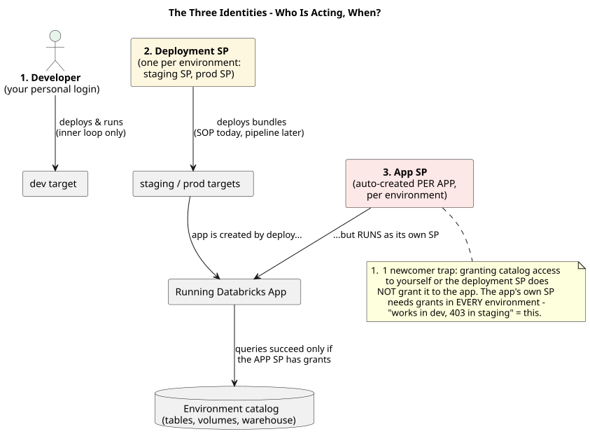
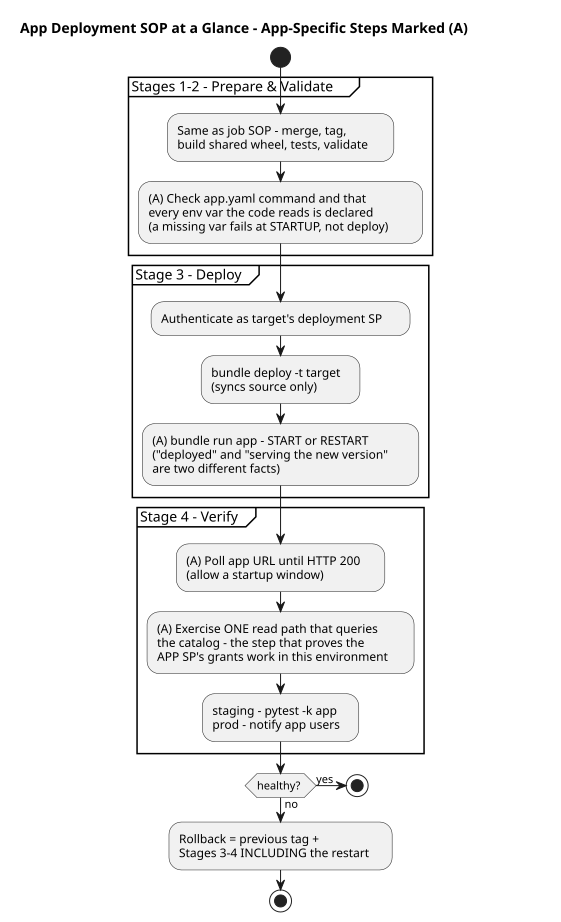

# SOP: Deploying a Databricks App (Bundle-Based)

**Scope:** deploying a Databricks App defined in a Databricks Asset Bundle to staging and production. In the monorepo, each project under `projects/` is its own bundle — **all `databricks bundle` commands run from inside the project folder** (e.g. `cd projects/sample-app`).
**Audience:** platform users deploying apps. No prior Databricks deployment experience assumed.
**Phase note:** executed manually today (Phase 1); each step carries a **⚙ Phase 2** annotation naming the pipeline stage that will own it. This SOP shares Stages 1–3 with the [job SOP](SOP-job-deployment.md) — read its "Before you start" section first for the bundle/target/deploy-vs-run mental model. The differences here are all in identity and verification, because an app *stays running and serves*, while a job *runs and finishes*.

## Before you start — the one idea apps add

Three different identities are in play, and confusing them causes nearly every app deployment problem:



**Reading the diagram:** three actors sit at the top — read them left to right as a timeline of *who acts when*: you (development), the deployment SP (release), the app SP (runtime, forever after). Now trace the two arrows into the "Running Databricks App" box and notice they come from *different* identities: the deployment SP *creates* the app, but the app *runs as* its own SP. Finally follow the bottom arrow to the catalog — that arrow succeeds or fails based on the **app SP's** grants alone. Nothing you or the deployment SP can access matters to it. The red note is the punchline: "works in dev, 403 in staging" is this arrow failing.

Your login deploys to dev. The environment's **deployment SP** deploys to staging/prod. But the app, once running, acts as a third identity: its **own auto-created SP**, one per app per environment. Granting catalog access to yourself or to the deployment SP does **not** grant it to the app. When an app works in dev and throws permission errors in staging, the missing grant on the *staging app SP* is the cause more often than everything else combined.

The second idea: **deploying and serving are separate facts.** `bundle deploy` syncs source; the app serves the new version only after a start/restart. A pipeline exit code of 0 on deploy proves nothing about what users are seeing.

## The whole SOP at a glance



**Reading the diagram:** the shape is the same five-stage skeleton as the job SOP — deliberately, so you only need to learn one process. Scan for the steps marked **(A)**: those are the only places apps differ, and there are just four of them — the startup-config check, the restart after deploy, the health poll, and the read-path probe. Notice in Stage 3 that deploy and restart are two separate boxes: that's the "deployed vs serving" distinction drawn as geometry. And in Stage 4, the read-path probe is its own step *after* the 200 check, because a healthy homepage proves the app started — only a real query proves its SP has grants.

## Prerequisites (one-time, per environment)

Everything in the job SOP's prerequisites, plus: **the app's own SP needs grants** in each target — `USE CATALOG` / `USE SCHEMA` / `SELECT` on the environment catalog, warehouse usage if it queries, and any secret scopes. The app SP appears in the workspace after the app's first deploy (find its name on the app's page in the workspace UI); granting is a one-time step per environment, verified in Stage 4. The grants, run by a catalog admin against each environment's catalog:

```sql
GRANT USE CATALOG ON CATALOG proj_stg TO `<app-sp-application-id>`;
GRANT USE SCHEMA  ON SCHEMA  proj_stg.silver TO `<app-sp-application-id>`;
GRANT SELECT      ON SCHEMA  proj_stg.silver TO `<app-sp-application-id>`;
-- plus, if the app queries via a SQL warehouse:
-- GRANT CAN_USE ON WAREHOUSE <warehouse> TO `<app-sp-application-id>`;
```

---

## Stage 1 — Prepare

Identical to the job SOP: merged to `main`, SHA noted, and for prod a signed-off release tag.

> ⚙ **Phase 2:** pipeline triggers (merge → staging, approved tag → prod).

## Stage 2 — Validate

**2.1** Build and distribute the shared library, from the repo root: `./scripts/build_shared.sh`. For apps this copies the `shared_core` wheel *into the app source*, where `requirements.txt` installs it at startup. *You should see:* the wheel file appear in `src/app/`. A missing wheel here means the app fails to start in Stage 4 — not at deploy time, which is what makes it confusing.
**2.2** `pytest libs/shared_core/tests`, then the app's own unit tests if present. All pass or the SOP stops.
**2.3** From the project folder: `databricks bundle validate -t staging` and `-t prod`. *You should see:* `Validation OK!`
**2.4** App-specific config check: confirm `src/app/app.yaml` declares the run command, and that **every env var the code reads** is declared in `resources/*_app.yml`. A missing env var fails at *startup*, not at deploy — catching it here saves a confusing Stage 4.

> ⚙ **Phase 2:** PR check stage with path filters (only the changed project runs; `libs/` changes run every consumer), including a config-completeness lint for 2.4.

## Stage 3 — Deploy

**3.1** Authenticate as the target's *deployment* service principal (same mechanics as the job SOP, Stage 3.1).
**3.2** `databricks bundle deploy -t staging` (or `-t prod`). *You should see:* `Deployment complete!` — the source is synced, but users are still on the old version.
**3.3** Start or restart the app so it serves the new source: `databricks bundle run sample_app -t staging`. This step is not optional and is the one people forget.
**3.4** Record in the deployment log: date, target, SHA/tag, deployer.

> ⚙ **Phase 2:** deploy stage, with the restart folded in as an explicit pipeline step so it can never be forgotten.

## Stage 4 — Verify

**4.1** Poll the app URL until it returns HTTP 200 (allow a startup window of a few minutes — the app is installing `requirements.txt`). *If it never comes up:* check the app logs; the two usual causes are a missing env var (Stage 2.4) or a missing wheel (Stage 2.1).
**4.2** Exercise one read path that touches the catalog — a page or API route that runs a real query. This is the step that proves the **app SP's grants** work in this environment; a 200 on a static page does not. *If this fails with a permission error:* grant the app SP (see Prerequisites) and re-test — no redeploy needed.
**4.3 Staging only:** run any app-tagged integration tests: `pytest tests/integration -k app`.
**4.4 Prod:** confirm the app URL, load the main page, exercise the same read path, and notify the app's users that the new version is live.

> ⚙ **Phase 2:** post-deploy verification stage — health poll and read-path probe run automatically; failure blocks release completion and alerts.

## Stage 5 — Rollback (if verification fails)

Same tag-based procedure as the job SOP: check out the previous release tag, rebuild the shared wheel from that tag, repeat Stages 3–4 — **including the restart in 3.3; a rollback that skips the restart rolls back nothing.** Record and open a forward-fix ticket.

> ⚙ **Phase 2:** re-run of the release pipeline on the prior tag.

---

## Common failures for newcomers

| Symptom | Likely cause | Where it's prevented |
|---|---|---|
| App never reaches HTTP 200 | missing env var, or shared wheel absent from app source | Stages 2.1, 2.4 |
| Works in dev, permission error in staging | staging **app SP** lacks catalog/warehouse grants | Prerequisites; verified at 4.2 |
| Deploy succeeded but users see the old version | restart (Stage 3.3) skipped | Stage 3.3 |
| Rollback "didn't work" | old source deployed but app not restarted | Stage 5 |
| App can't find `shared_core` | wheel filename in `requirements.txt` doesn't match the built version | Stage 2.1; keep versions in sync |

## Failure rules (all stages)

Identical to the job SOP: a failed step stops the process, skipped steps require recorded written approval, and Phase 2 converts these rules from policy into pipeline behavior.
