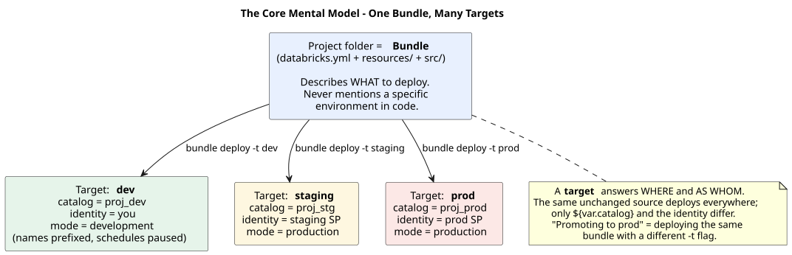
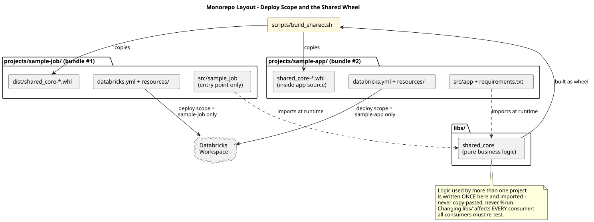
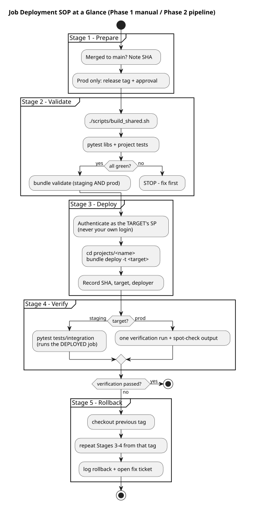

# SOP: Deploying a Databricks Job (Bundle-Based)

**Scope:** deploying a Lakeflow Job defined in a Databricks Asset Bundle to staging and production. In the monorepo, each project under `projects/` is its own bundle — **all `databricks bundle` commands in this SOP run from inside the project folder** (e.g. `cd projects/sample-job`), and deploying one project never touches another.
**Audience:** platform users deploying jobs. No prior Databricks deployment experience assumed — read "Before you start" first if the terms are new to you.
**Phase note:** these steps are executed manually today (Phase 1). Each step carries a **⚙ Phase 2** annotation naming the pipeline stage that will eventually execute it automatically. When the pipeline exists, this SOP becomes its specification, not a parallel process.

## Before you start — the mental model

Four terms carry this entire document. In plain language:

| Term | What it actually means |
|---|---|
| **Bundle** | The project folder itself. `databricks.yml` plus `resources/` and `src/` describe *everything* the workload needs. If it isn't in the folder, it doesn't get deployed. |
| **Target** | A named environment configuration inside `databricks.yml` — *where* the bundle deploys and *as whom*. `dev`, `staging`, and `prod` are targets, not separate codebases. |
| **Deploy vs run** | `bundle deploy` makes the workspace *match the folder* (creates/updates the job definition). `bundle run` *executes* the deployed job. Deploying does not run anything. |
| **Service principal (SP)** | A robot identity. Staging and prod are deployed only by their environment's SP — never by a person's login — so no human account ever owns a production resource. |

The single most important idea: **you never edit anything to promote a change.** The same unchanged bundle deploys to every environment; only the `-t` flag differs, and the target supplies the catalog name and identity.



**Reading the diagram:** start at the blue box — that's your project folder, and notice it contains no environment names anywhere. Follow any of the three arrows: each is the *same* `bundle deploy` command with a different `-t` flag, and each lands in a colored target box. Now compare the three target boxes — the *only* things that differ are the catalog name, the identity, and the mode. That's the takeaway: environments differ in configuration, never in code, so there is nothing to edit, merge, or copy when promoting.

Because this is a monorepo, one more concept: shared logic lives in `libs/shared_core` and reaches your job as a **wheel** (a built Python package) that the build script copies into your project's `dist/` folder. Your job imports it; it never copy-pastes it.



**Reading the diagram:** two separate stories share this picture. First trace the solid arrows from `libs/shared_core` through the build script into each project — that's the wheel's *distribution* path, which is why Stage 2.1 exists. The dotted arrows are different: they show your code *importing* the library at runtime. Second, look at the two arrows into the workspace and notice they come from each project's own `databricks.yml` independently — deploying `sample-job` cannot touch `sample-app`, which is the whole point of one-bundle-per-folder. The warning note at the bottom is the trade-off: shared code means shared blast radius, so a `libs/` change obligates every consumer to re-test.

## The whole SOP at a glance



**Reading the diagram:** read top to bottom — the five partitions are the five stages of this SOP in order, so this is your map for everything below. Two things to notice before diving into the numbered steps: every decision diamond that answers "no" either stops the process or routes into Rollback — there is no path that continues past a failure. And the Deploy partition is the only place an identity change happens (you switch from your login to the target's SP), which is why credential mistakes always surface in Stage 3.

## Prerequisites (one-time)

The bundle follows the template structure. The staging and prod service principals exist, hold write grants on their respective catalogs only, and their OAuth credentials are stored in the approved secret store. You have permission to *use* those credentials for the environment you are deploying to — staging credentials cannot deploy to prod, by design.

---

## Stage 1 — Prepare

**1.1** Confirm the change is merged to `main`. Never deploy from a feature branch to staging or prod.
**1.2** Pull latest `main` locally and note the commit SHA — this is your deployment record.
**1.3** For a prod deployment: confirm a release tag (`vX.Y.Z`) exists on that SHA and that the release has written approval (PR approval or ticket sign-off).

> ⚙ **Phase 2:** the pipeline trigger replaces this stage entirely — merge triggers staging, tag + approval gate triggers prod.

## Stage 2 — Validate

**2.1** Build and distribute the shared library, from the repo root: `./scripts/build_shared.sh`. *You should see:* `shared_core wheel distributed to consuming projects.` A stale or missing shared wheel is a deploy-time failure you prevent here.
**2.2** Run the shared library's tests, then the project's: `pytest libs/shared_core/tests`, then from the project folder `pytest tests/unit`. *You should see:* all tests passed. If any fail, stop — the SOP does not continue past failing tests for any reason.
**2.3** From the project folder, validate the bundle configuration for staging *and* prod (catching a prod config typo now is free; catching it at release time is an incident):

```bash
databricks bundle validate -t staging
databricks bundle validate -t prod
```

*You should see:* `Validation OK!` for each. An error here means a config problem (bad reference, missing variable) — nothing has touched the workspace yet.

> ⚙ **Phase 2:** PR check stage — runs on every pull request, blocks merge on failure, with **path filters** so only the changed project's checks run (a change under `libs/` runs every consumer's checks).

## Stage 3 — Deploy

**3.1** Authenticate as the target's service principal (never your personal identity for staging/prod):

```bash
export DATABRICKS_HOST=https://<workspace-url>
export DATABRICKS_CLIENT_ID=<sp-application-id>
export DATABRICKS_CLIENT_SECRET=<from-secret-store>
```

**3.2** Deploy from the project folder: `databricks bundle deploy -t staging` (or `-t prod`). *You should see:* upload progress ending in `Deployment complete!` Remember: the job now *exists/is updated* in the workspace — nothing has run yet.
**3.3** Record in the deployment log: date, target, commit SHA / tag, deployer, bundle name.

> ⚙ **Phase 2:** deploy stage — CI holds the SP credentials as environment-scoped secrets; step 3.1 disappears from human hands entirely.

## Stage 4 — Verify

**4.1 Staging:** run the integration tests against the deployed bundle: `pytest tests/integration` (with the staging credentials from 3.1 still in the environment). These trigger the deployed job, wait for completion, and assert on outputs. All must pass before the change is eligible for a prod release.
**4.2 Prod:** trigger one verification run: `databricks bundle run sample_job -t prod` and confirm `SUCCESS` in the run output. Spot-check the output table row counts against the previous run.

> ⚙ **Phase 2:** post-deploy verification stage — a failed verification automatically blocks the release and alerts the channel.

## Stage 5 — Rollback (if verification fails)

**5.1** Do not attempt in-place fixes on prod. Check out the previous release tag, then repeat Stages 2.1 and 3–4 from that tag (the shared wheel must be rebuilt from the old source too). Because a tag pins an exact bundle state, rollback *is* the deploy process pointed at older source — there is no separate restore procedure.
**5.2** Record the rollback in the deployment log and open a ticket for the forward fix.

> ⚙ **Phase 2:** re-run of the release pipeline on the prior tag — one click.

---

## Common failures for newcomers

| Symptom | Likely cause | Where it's prevented |
|---|---|---|
| `validate` fails with unresolved variable | typo in `databricks.yml` or missing target value | Stage 2.3 |
| Deploy fails: wheel not found | `build_shared.sh` not run (or run before pulling latest) | Stage 2.1 |
| Deploy succeeds but job "isn't there" | looking in the wrong target, or dev-mode name prefix | mental model: check the target's `root_path` |
| Job runs but writes to the wrong catalog | catalog hardcoded in code instead of passed as parameter | code review; nothing hardcodes an environment |
| `PERMISSION_DENIED` on deploy | authenticated as yourself, or the wrong environment's SP | Stage 3.1 |

## Failure rules (all stages)

A failed step stops the SOP; steps are never skipped or reordered. If a step must be waived, the waiver requires the same written approval as a prod release and is recorded in the deployment log. (In Phase 2 these rules stop being policy and become physics — the pipeline simply will not proceed.)
