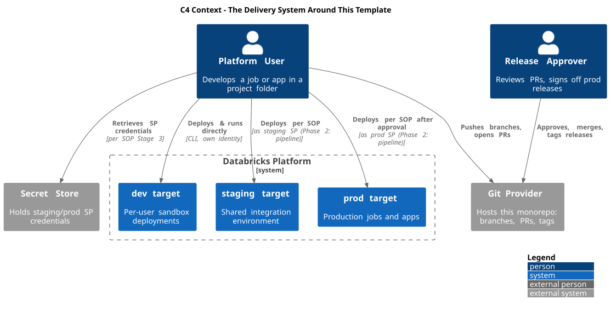
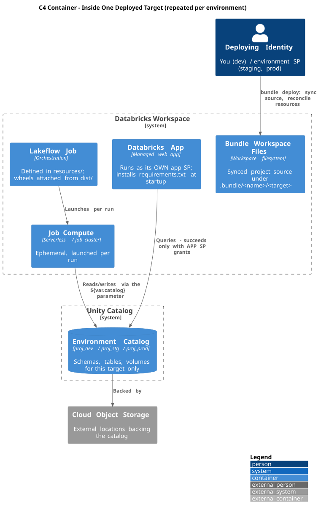
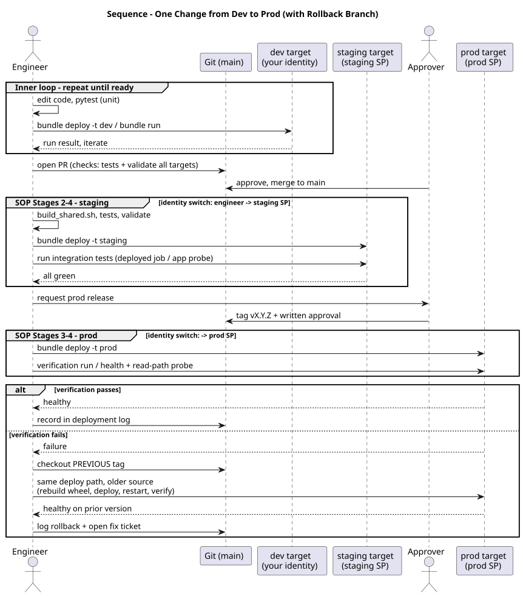

# Architecture Views

The diagrams in the SOPs explain *concepts* (bundles, targets, identities) and *procedures* (the SOP flows). This document sits one level above: the C4 views show the system landscape those concepts live in, and the sequence view shows one change moving through the whole system over time. Read top to bottom for a complete zoom-out-to-zoom-in tour; each diagram links to its editable source in [`diagrams/`](diagrams/).

## C4 Context — the delivery system

**Reading the diagram:** two people, four systems. Start with the Platform User and count their outgoing arrows — that's the whole job: push code, pull credentials, deploy to targets. Notice the *labels* on the three arrows into the Databricks boundary: the dev arrow says "own identity" while staging and prod say "as SP" — the identity model from the SOPs, visible at the highest zoom level. The "(Phase 2: pipeline)" notes mark exactly which arrows the future pipeline takes over: the user's staging and prod arrows move to CI, and everything else stays the same. That's the takeaway — automation changes *who executes* two arrows, not the shape of the system.

*Source: [`diagrams/06-c4-context.puml`](diagrams/06-c4-context.puml)*

## C4 Container — inside one target

**Reading the diagram:** this box structure repeats identically for dev, staging, and prod — only the catalog name and the deploying identity change, which is why one diagram covers all three. Trace the deploy arrow first: it touches only the workspace files (sync + reconcile); nothing runs. Then compare the two arrows into the catalog: the job reaches it *through compute*, parameterized by `${var.catalog}`, while the app reaches it *directly as its own SP* — two different arrows, two different failure modes, and the reason the two SOPs verify differently. The component level below this view is diagram 02 in the SOPs (the monorepo layout); it isn't repeated here.

*Source: [`diagrams/07-c4-container.puml`](diagrams/07-c4-container.puml)*

## Sequence — one change, dev to prod, including rollback

**Reading the diagram:** time flows downward; the lifelines across the top are everyone who participates in a single change. Three things to watch for. First, the identity switches: the engineer's messages hit the dev target directly, but every message to staging and prod happens *after* the group headers announce a switch to that environment's SP — the sequence makes visible that "you" are a different actor in each phase. Second, the Approver appears exactly twice — merge and tag — which is the entire human-gate surface of the process; everything else is mechanical. Third, and the reason this diagram exists: look inside the `alt` fragment at the bottom. The rollback branch sends *the same messages* to prod as the happy path — checkout, deploy, restart, verify — just from an older tag. Rollback isn't a different procedure; it's the same conversation, replayed. When Phase 2 arrives, the engineer's lifeline in the staging and prod groups is replaced by a CI lifeline, and nothing else in the picture moves.

*Source: [`diagrams/08-delivery-sequence.puml`](diagrams/08-delivery-sequence.puml)*
